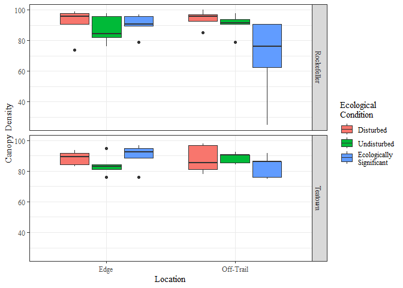
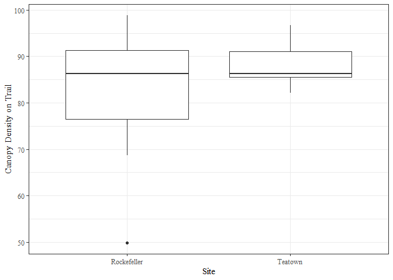
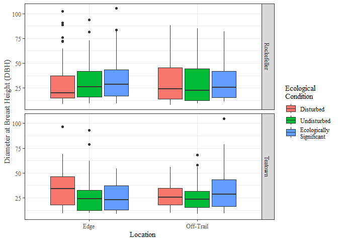
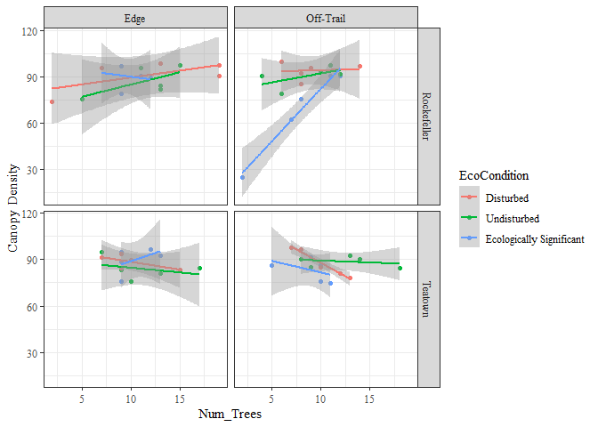

Final Thesis
================
Mathyas Papp
2022-12-08

Load packages.

``` r
library(readxl)
library(tidyverse)
```

    ## ── Attaching packages ─────────────────────────────────────── tidyverse 1.3.2 ──
    ## ✔ ggplot2 3.4.0      ✔ purrr   0.3.5 
    ## ✔ tibble  3.1.8      ✔ dplyr   1.0.10
    ## ✔ tidyr   1.2.1      ✔ stringr 1.5.0 
    ## ✔ readr   2.1.3      ✔ forcats 0.5.2 
    ## ── Conflicts ────────────────────────────────────────── tidyverse_conflicts() ──
    ## ✖ dplyr::filter() masks stats::filter()
    ## ✖ dplyr::lag()    masks stats::lag()

``` r
library(knitr)
library(ggplot2)
library(cowplot)
windowsFonts("Times" = windowsFont("Times"))
```

Read in ground cover data.

``` r
papp_ground <- read_xlsx(path = "~/Projects/RSPP/PappFieldData.xlsx", sheet = 2)
papp_species <- read.csv("~/Projects/RSPP/Species_List.csv")
papp_ground <- left_join(papp_ground, papp_species, by = "Species")

# Change order of ecological conditions
papp_ground$EcoCondition <- factor(papp_ground$EcoCondition, 
                                   levels = c("Disturbed", "Undisturbed", "Ecologically Significant"))
```

# Canopy Density Analysis

- Collapse the data set so we have one canopy density value per plot

``` r
canopy_dens <- 
  papp_ground %>%
  group_by(Site, Plot_Num, Location, EcoCondition) %>%
  summarise(Canopy_Density = unique(Canopy_Density),
            Canopy_Density_Adj_Trail = unique(Canopy_Density_Adjacent_Trail))
```

    ## `summarise()` has grouped output by 'Site', 'Plot_Num', 'Location'. You can
    ## override using the `.groups` argument.

## Visualizing the data

- Plot Canopy Density using facets to split by site and color to
  separate by ecocondition

``` r
ggplot(data = canopy_dens, aes(x = Location, y = Canopy_Density, fill = EcoCondition)) +
  geom_boxplot() +
  facet_grid(Site~.) +
  ylab("Canopy Density") + 
  scale_fill_discrete(name = "Ecological\nCondition",
                      breaks = c("Disturbed", "Undisturbed", "Ecologically Significant"),
                      labels = c("Disturbed", "Undisturbed", "Ecologically\nSignificant")) +
  theme_bw(base_family = "Times")
```

<!-- -->

``` r
ggsave("../manuscript/figures/Figure-3-CanDens-Loc-Site.tiff", device = "tiff", width = 6.5, height = 4, units = "in")
```

    ## Warning in grDevices::dev.off(): unable to open TIFF file
    ## '../manuscript/figures/Figure-3-CanDens-Loc-Site.tiff'

- Plot Canopy Density of Adjacent Trails using ggplot to split by site

``` r
ggplot(data = canopy_dens, aes(x = Site, y = Canopy_Density_Adj_Trail)) +
  geom_boxplot() +
  ylab("Canopy Density on Trail") + 
  theme_bw(base_family = "Times")
```

<!-- -->

``` r
ggsave("../manuscript/figures/Figure-4-CanDens-Adj.tiff", device = "tiff", width = 6.5, height = 4, units = "in")
```

    ## Warning in grDevices::dev.off(): unable to open TIFF file
    ## '../manuscript/figures/Figure-4-CanDens-Adj.tiff'

## Statistical Analysis

- Perform an ANOVA to check for differences in Canopy Density at Sites,
  Locations, and EcoConditions

``` r
canopy_dens_lm_all <- lm(data = canopy_dens, Canopy_Density ~ Site * Location * EcoCondition )
kable(anova(canopy_dens_lm_all), digits = 3, format = "pandoc", caption = "ANOVA table of Canopy Density")
```

|                            |  Df |   Sum Sq | Mean Sq | F value | Pr(\>F) |
|----------------------------|----:|---------:|--------:|--------:|--------:|
| Site                       |   1 |    0.288 |   0.288 |   0.003 |   0.960 |
| Location                   |   1 |  133.325 | 133.325 |   1.192 |   0.280 |
| EcoCondition               |   2 |  562.756 | 281.378 |   2.516 |   0.091 |
| Site:Location              |   1 |   69.295 |  69.295 |   0.620 |   0.435 |
| Site:EcoCondition          |   2 |  366.698 | 183.349 |   1.639 |   0.205 |
| Location:EcoCondition      |   2 |  939.946 | 469.973 |   4.202 |   0.021 |
| Site:Location:EcoCondition |   2 |  219.817 | 109.909 |   0.983 |   0.382 |
| Residuals                  |  48 | 5368.197 | 111.837 |      NA |      NA |

ANOVA table of Canopy Density

- Perform a t-test to check for differences in Canopy Density at
  Adjacent Trails

``` r
with(canopy_dens, kable(t.test(Canopy_Density_Adj_Trail ~ Site)))
```

- Pair-wise comparisons for clarity

``` r
canopy_dens_aov <- aov(data = canopy_dens, Canopy_Density ~ Site * Location * EcoCondition )
TukeyHSD(canopy_dens_aov)
```

    ##   Tukey multiple comparisons of means
    ##     95% family-wise confidence level
    ## 
    ## Fit: aov(formula = Canopy_Density ~ Site * Location * EcoCondition, data = canopy_dens)
    ## 
    ## $Site
    ##                           diff       lwr      upr     p adj
    ## Teatown-Rockefeller -0.1386667 -5.628778 5.351445 0.9597086
    ## 
    ## $Location
    ##                     diff       lwr      upr     p adj
    ## Off-Trail-Edge -2.981333 -8.471445 2.508778 0.2803497
    ## 
    ## $EcoCondition
    ##                                        diff       lwr       upr     p adj
    ## Undisturbed-Disturbed                -2.860 -10.94793 5.2279317 0.6708158
    ## Ecologically Significant-Disturbed   -7.436 -15.52393 0.6519317 0.0773537
    ## Ecologically Significant-Undisturbed -4.576 -12.66393 3.5119317 0.3653587
    ## 
    ## $`Site:Location`
    ##                                              diff        lwr       upr
    ## Teatown:Edge-Rockefeller:Edge           -2.288000 -12.565053  7.989053
    ## Rockefeller:Off-Trail-Rockefeller:Edge  -5.130667 -15.407720  5.146387
    ## Teatown:Off-Trail-Rockefeller:Edge      -3.120000 -13.397053  7.157053
    ## Rockefeller:Off-Trail-Teatown:Edge      -2.842667 -13.119720  7.434387
    ## Teatown:Off-Trail-Teatown:Edge          -0.832000 -11.109053  9.445053
    ## Teatown:Off-Trail-Rockefeller:Off-Trail  2.010667  -8.266387 12.287720
    ##                                             p adj
    ## Teatown:Edge-Rockefeller:Edge           0.9338646
    ## Rockefeller:Off-Trail-Rockefeller:Edge  0.5495921
    ## Teatown:Off-Trail-Rockefeller:Edge      0.8503765
    ## Rockefeller:Off-Trail-Teatown:Edge      0.8820403
    ## Teatown:Off-Trail-Teatown:Edge          0.9964185
    ## Teatown:Off-Trail-Rockefeller:Off-Trail 0.9537112
    ## 
    ## $`Site:EcoCondition`
    ##                                                                          diff
    ## Teatown:Disturbed-Rockefeller:Disturbed                                -4.576
    ## Rockefeller:Undisturbed-Rockefeller:Disturbed                          -3.848
    ## Teatown:Undisturbed-Rockefeller:Disturbed                              -6.448
    ## Rockefeller:Ecologically Significant-Rockefeller:Disturbed            -13.104
    ## Teatown:Ecologically Significant-Rockefeller:Disturbed                 -6.344
    ## Rockefeller:Undisturbed-Teatown:Disturbed                               0.728
    ## Teatown:Undisturbed-Teatown:Disturbed                                  -1.872
    ## Rockefeller:Ecologically Significant-Teatown:Disturbed                 -8.528
    ## Teatown:Ecologically Significant-Teatown:Disturbed                     -1.768
    ## Teatown:Undisturbed-Rockefeller:Undisturbed                            -2.600
    ## Rockefeller:Ecologically Significant-Rockefeller:Undisturbed           -9.256
    ## Teatown:Ecologically Significant-Rockefeller:Undisturbed               -2.496
    ## Rockefeller:Ecologically Significant-Teatown:Undisturbed               -6.656
    ## Teatown:Ecologically Significant-Teatown:Undisturbed                    0.104
    ## Teatown:Ecologically Significant-Rockefeller:Ecologically Significant   6.760
    ##                                                                              lwr
    ## Teatown:Disturbed-Rockefeller:Disturbed                               -18.612444
    ## Rockefeller:Undisturbed-Rockefeller:Disturbed                         -17.884444
    ## Teatown:Undisturbed-Rockefeller:Disturbed                             -20.484444
    ## Rockefeller:Ecologically Significant-Rockefeller:Disturbed            -27.140444
    ## Teatown:Ecologically Significant-Rockefeller:Disturbed                -20.380444
    ## Rockefeller:Undisturbed-Teatown:Disturbed                             -13.308444
    ## Teatown:Undisturbed-Teatown:Disturbed                                 -15.908444
    ## Rockefeller:Ecologically Significant-Teatown:Disturbed                -22.564444
    ## Teatown:Ecologically Significant-Teatown:Disturbed                    -15.804444
    ## Teatown:Undisturbed-Rockefeller:Undisturbed                           -16.636444
    ## Rockefeller:Ecologically Significant-Rockefeller:Undisturbed          -23.292444
    ## Teatown:Ecologically Significant-Rockefeller:Undisturbed              -16.532444
    ## Rockefeller:Ecologically Significant-Teatown:Undisturbed              -20.692444
    ## Teatown:Ecologically Significant-Teatown:Undisturbed                  -13.932444
    ## Teatown:Ecologically Significant-Rockefeller:Ecologically Significant  -7.276444
    ##                                                                              upr
    ## Teatown:Disturbed-Rockefeller:Disturbed                                9.4604442
    ## Rockefeller:Undisturbed-Rockefeller:Disturbed                         10.1884442
    ## Teatown:Undisturbed-Rockefeller:Disturbed                              7.5884442
    ## Rockefeller:Ecologically Significant-Rockefeller:Disturbed             0.9324442
    ## Teatown:Ecologically Significant-Rockefeller:Disturbed                 7.6924442
    ## Rockefeller:Undisturbed-Teatown:Disturbed                             14.7644442
    ## Teatown:Undisturbed-Teatown:Disturbed                                 12.1644442
    ## Rockefeller:Ecologically Significant-Teatown:Disturbed                 5.5084442
    ## Teatown:Ecologically Significant-Teatown:Disturbed                    12.2684442
    ## Teatown:Undisturbed-Rockefeller:Undisturbed                           11.4364442
    ## Rockefeller:Ecologically Significant-Rockefeller:Undisturbed           4.7804442
    ## Teatown:Ecologically Significant-Rockefeller:Undisturbed              11.5404442
    ## Rockefeller:Ecologically Significant-Teatown:Undisturbed               7.3804442
    ## Teatown:Ecologically Significant-Teatown:Undisturbed                  14.1404442
    ## Teatown:Ecologically Significant-Rockefeller:Ecologically Significant 20.7964442
    ##                                                                           p adj
    ## Teatown:Disturbed-Rockefeller:Disturbed                               0.9259087
    ## Rockefeller:Undisturbed-Rockefeller:Disturbed                         0.9636221
    ## Teatown:Undisturbed-Rockefeller:Disturbed                             0.7481491
    ## Rockefeller:Ecologically Significant-Rockefeller:Disturbed            0.0799562
    ## Teatown:Ecologically Significant-Rockefeller:Disturbed                0.7606706
    ## Rockefeller:Undisturbed-Teatown:Disturbed                             0.9999871
    ## Teatown:Undisturbed-Teatown:Disturbed                                 0.9986655
    ## Rockefeller:Ecologically Significant-Teatown:Disturbed                0.4734354
    ## Teatown:Ecologically Significant-Teatown:Disturbed                    0.9989870
    ## Teatown:Undisturbed-Rockefeller:Undisturbed                           0.9936793
    ## Rockefeller:Ecologically Significant-Rockefeller:Undisturbed          0.3814957
    ## Teatown:Ecologically Significant-Rockefeller:Undisturbed              0.9947730
    ## Rockefeller:Ecologically Significant-Teatown:Undisturbed              0.7224356
    ## Teatown:Ecologically Significant-Teatown:Undisturbed                  1.0000000
    ## Teatown:Ecologically Significant-Rockefeller:Ecologically Significant 0.7092780
    ## 
    ## $`Location:EcoCondition`
    ##                                                                     diff
    ## Off-Trail:Disturbed-Edge:Disturbed                                 1.040
    ## Edge:Undisturbed-Edge:Disturbed                                   -4.368
    ## Off-Trail:Undisturbed-Edge:Disturbed                              -0.312
    ## Edge:Ecologically Significant-Edge:Disturbed                       0.104
    ## Off-Trail:Ecologically Significant-Edge:Disturbed                -13.936
    ## Edge:Undisturbed-Off-Trail:Disturbed                              -5.408
    ## Off-Trail:Undisturbed-Off-Trail:Disturbed                         -1.352
    ## Edge:Ecologically Significant-Off-Trail:Disturbed                 -0.936
    ## Off-Trail:Ecologically Significant-Off-Trail:Disturbed           -14.976
    ## Off-Trail:Undisturbed-Edge:Undisturbed                             4.056
    ## Edge:Ecologically Significant-Edge:Undisturbed                     4.472
    ## Off-Trail:Ecologically Significant-Edge:Undisturbed               -9.568
    ## Edge:Ecologically Significant-Off-Trail:Undisturbed                0.416
    ## Off-Trail:Ecologically Significant-Off-Trail:Undisturbed         -13.624
    ## Off-Trail:Ecologically Significant-Edge:Ecologically Significant -14.040
    ##                                                                         lwr
    ## Off-Trail:Disturbed-Edge:Disturbed                               -12.996444
    ## Edge:Undisturbed-Edge:Disturbed                                  -18.404444
    ## Off-Trail:Undisturbed-Edge:Disturbed                             -14.348444
    ## Edge:Ecologically Significant-Edge:Disturbed                     -13.932444
    ## Off-Trail:Ecologically Significant-Edge:Disturbed                -27.972444
    ## Edge:Undisturbed-Off-Trail:Disturbed                             -19.444444
    ## Off-Trail:Undisturbed-Off-Trail:Disturbed                        -15.388444
    ## Edge:Ecologically Significant-Off-Trail:Disturbed                -14.972444
    ## Off-Trail:Ecologically Significant-Off-Trail:Disturbed           -29.012444
    ## Off-Trail:Undisturbed-Edge:Undisturbed                            -9.980444
    ## Edge:Ecologically Significant-Edge:Undisturbed                    -9.564444
    ## Off-Trail:Ecologically Significant-Edge:Undisturbed              -23.604444
    ## Edge:Ecologically Significant-Off-Trail:Undisturbed              -13.620444
    ## Off-Trail:Ecologically Significant-Off-Trail:Undisturbed         -27.660444
    ## Off-Trail:Ecologically Significant-Edge:Ecologically Significant -28.076444
    ##                                                                           upr
    ## Off-Trail:Disturbed-Edge:Disturbed                               15.076444243
    ## Edge:Undisturbed-Edge:Disturbed                                   9.668444243
    ## Off-Trail:Undisturbed-Edge:Disturbed                             13.724444243
    ## Edge:Ecologically Significant-Edge:Disturbed                     14.140444243
    ## Off-Trail:Ecologically Significant-Edge:Disturbed                 0.100444243
    ## Edge:Undisturbed-Off-Trail:Disturbed                              8.628444243
    ## Off-Trail:Undisturbed-Off-Trail:Disturbed                        12.684444243
    ## Edge:Ecologically Significant-Off-Trail:Disturbed                13.100444243
    ## Off-Trail:Ecologically Significant-Off-Trail:Disturbed           -0.939555757
    ## Off-Trail:Undisturbed-Edge:Undisturbed                           18.092444243
    ## Edge:Ecologically Significant-Edge:Undisturbed                   18.508444243
    ## Off-Trail:Ecologically Significant-Edge:Undisturbed               4.468444243
    ## Edge:Ecologically Significant-Off-Trail:Undisturbed              14.452444243
    ## Off-Trail:Ecologically Significant-Off-Trail:Undisturbed          0.412444243
    ## Off-Trail:Ecologically Significant-Edge:Ecologically Significant -0.003555757
    ##                                                                      p adj
    ## Off-Trail:Disturbed-Edge:Disturbed                               0.9999246
    ## Edge:Undisturbed-Edge:Disturbed                                  0.9384857
    ## Off-Trail:Undisturbed-Edge:Disturbed                             0.9999998
    ## Edge:Ecologically Significant-Edge:Disturbed                     1.0000000
    ## Off-Trail:Ecologically Significant-Edge:Disturbed                0.0526699
    ## Edge:Undisturbed-Off-Trail:Disturbed                             0.8606004
    ## Off-Trail:Undisturbed-Off-Trail:Disturbed                        0.9997256
    ## Edge:Ecologically Significant-Off-Trail:Disturbed                0.9999552
    ## Off-Trail:Ecologically Significant-Off-Trail:Disturbed           0.0302517
    ## Off-Trail:Undisturbed-Edge:Undisturbed                           0.9546143
    ## Edge:Ecologically Significant-Edge:Undisturbed                   0.9323831
    ## Off-Trail:Ecologically Significant-Edge:Undisturbed              0.3448458
    ## Edge:Ecologically Significant-Off-Trail:Undisturbed              0.9999992
    ## Off-Trail:Ecologically Significant-Off-Trail:Undisturbed         0.0617714
    ## Off-Trail:Ecologically Significant-Edge:Ecologically Significant 0.0499077
    ## 
    ## $`Site:Location:EcoCondition`
    ##                                                                                              diff
    ## Teatown:Edge:Disturbed-Rockefeller:Edge:Disturbed                                          -2.912
    ## Rockefeller:Off-Trail:Disturbed-Rockefeller:Edge:Disturbed                                  2.704
    ## Teatown:Off-Trail:Disturbed-Rockefeller:Edge:Disturbed                                     -3.536
    ## Rockefeller:Edge:Undisturbed-Rockefeller:Edge:Disturbed                                    -4.160
    ## Teatown:Edge:Undisturbed-Rockefeller:Edge:Disturbed                                        -7.488
    ## Rockefeller:Off-Trail:Undisturbed-Rockefeller:Edge:Disturbed                               -0.832
    ## Teatown:Off-Trail:Undisturbed-Rockefeller:Edge:Disturbed                                   -2.704
    ## Rockefeller:Edge:Ecologically Significant-Rockefeller:Edge:Disturbed                       -1.040
    ## Teatown:Edge:Ecologically Significant-Rockefeller:Edge:Disturbed                           -1.664
    ## Rockefeller:Off-Trail:Ecologically Significant-Rockefeller:Edge:Disturbed                 -22.464
    ## Teatown:Off-Trail:Ecologically Significant-Rockefeller:Edge:Disturbed                      -8.320
    ## Rockefeller:Off-Trail:Disturbed-Teatown:Edge:Disturbed                                      5.616
    ## Teatown:Off-Trail:Disturbed-Teatown:Edge:Disturbed                                         -0.624
    ## Rockefeller:Edge:Undisturbed-Teatown:Edge:Disturbed                                        -1.248
    ## Teatown:Edge:Undisturbed-Teatown:Edge:Disturbed                                            -4.576
    ## Rockefeller:Off-Trail:Undisturbed-Teatown:Edge:Disturbed                                    2.080
    ## Teatown:Off-Trail:Undisturbed-Teatown:Edge:Disturbed                                        0.208
    ## Rockefeller:Edge:Ecologically Significant-Teatown:Edge:Disturbed                            1.872
    ## Teatown:Edge:Ecologically Significant-Teatown:Edge:Disturbed                                1.248
    ## Rockefeller:Off-Trail:Ecologically Significant-Teatown:Edge:Disturbed                     -19.552
    ## Teatown:Off-Trail:Ecologically Significant-Teatown:Edge:Disturbed                          -5.408
    ## Teatown:Off-Trail:Disturbed-Rockefeller:Off-Trail:Disturbed                                -6.240
    ## Rockefeller:Edge:Undisturbed-Rockefeller:Off-Trail:Disturbed                               -6.864
    ## Teatown:Edge:Undisturbed-Rockefeller:Off-Trail:Disturbed                                  -10.192
    ## Rockefeller:Off-Trail:Undisturbed-Rockefeller:Off-Trail:Disturbed                          -3.536
    ## Teatown:Off-Trail:Undisturbed-Rockefeller:Off-Trail:Disturbed                              -5.408
    ## Rockefeller:Edge:Ecologically Significant-Rockefeller:Off-Trail:Disturbed                  -3.744
    ## Teatown:Edge:Ecologically Significant-Rockefeller:Off-Trail:Disturbed                      -4.368
    ## Rockefeller:Off-Trail:Ecologically Significant-Rockefeller:Off-Trail:Disturbed            -25.168
    ## Teatown:Off-Trail:Ecologically Significant-Rockefeller:Off-Trail:Disturbed                -11.024
    ## Rockefeller:Edge:Undisturbed-Teatown:Off-Trail:Disturbed                                   -0.624
    ## Teatown:Edge:Undisturbed-Teatown:Off-Trail:Disturbed                                       -3.952
    ## Rockefeller:Off-Trail:Undisturbed-Teatown:Off-Trail:Disturbed                               2.704
    ## Teatown:Off-Trail:Undisturbed-Teatown:Off-Trail:Disturbed                                   0.832
    ## Rockefeller:Edge:Ecologically Significant-Teatown:Off-Trail:Disturbed                       2.496
    ## Teatown:Edge:Ecologically Significant-Teatown:Off-Trail:Disturbed                           1.872
    ## Rockefeller:Off-Trail:Ecologically Significant-Teatown:Off-Trail:Disturbed                -18.928
    ## Teatown:Off-Trail:Ecologically Significant-Teatown:Off-Trail:Disturbed                     -4.784
    ## Teatown:Edge:Undisturbed-Rockefeller:Edge:Undisturbed                                      -3.328
    ## Rockefeller:Off-Trail:Undisturbed-Rockefeller:Edge:Undisturbed                              3.328
    ## Teatown:Off-Trail:Undisturbed-Rockefeller:Edge:Undisturbed                                  1.456
    ## Rockefeller:Edge:Ecologically Significant-Rockefeller:Edge:Undisturbed                      3.120
    ## Teatown:Edge:Ecologically Significant-Rockefeller:Edge:Undisturbed                          2.496
    ## Rockefeller:Off-Trail:Ecologically Significant-Rockefeller:Edge:Undisturbed               -18.304
    ## Teatown:Off-Trail:Ecologically Significant-Rockefeller:Edge:Undisturbed                    -4.160
    ## Rockefeller:Off-Trail:Undisturbed-Teatown:Edge:Undisturbed                                  6.656
    ## Teatown:Off-Trail:Undisturbed-Teatown:Edge:Undisturbed                                      4.784
    ## Rockefeller:Edge:Ecologically Significant-Teatown:Edge:Undisturbed                          6.448
    ## Teatown:Edge:Ecologically Significant-Teatown:Edge:Undisturbed                              5.824
    ## Rockefeller:Off-Trail:Ecologically Significant-Teatown:Edge:Undisturbed                   -14.976
    ## Teatown:Off-Trail:Ecologically Significant-Teatown:Edge:Undisturbed                        -0.832
    ## Teatown:Off-Trail:Undisturbed-Rockefeller:Off-Trail:Undisturbed                            -1.872
    ## Rockefeller:Edge:Ecologically Significant-Rockefeller:Off-Trail:Undisturbed                -0.208
    ## Teatown:Edge:Ecologically Significant-Rockefeller:Off-Trail:Undisturbed                    -0.832
    ## Rockefeller:Off-Trail:Ecologically Significant-Rockefeller:Off-Trail:Undisturbed          -21.632
    ## Teatown:Off-Trail:Ecologically Significant-Rockefeller:Off-Trail:Undisturbed               -7.488
    ## Rockefeller:Edge:Ecologically Significant-Teatown:Off-Trail:Undisturbed                     1.664
    ## Teatown:Edge:Ecologically Significant-Teatown:Off-Trail:Undisturbed                         1.040
    ## Rockefeller:Off-Trail:Ecologically Significant-Teatown:Off-Trail:Undisturbed              -19.760
    ## Teatown:Off-Trail:Ecologically Significant-Teatown:Off-Trail:Undisturbed                   -5.616
    ## Teatown:Edge:Ecologically Significant-Rockefeller:Edge:Ecologically Significant            -0.624
    ## Rockefeller:Off-Trail:Ecologically Significant-Rockefeller:Edge:Ecologically Significant  -21.424
    ## Teatown:Off-Trail:Ecologically Significant-Rockefeller:Edge:Ecologically Significant       -7.280
    ## Rockefeller:Off-Trail:Ecologically Significant-Teatown:Edge:Ecologically Significant      -20.800
    ## Teatown:Off-Trail:Ecologically Significant-Teatown:Edge:Ecologically Significant           -6.656
    ## Teatown:Off-Trail:Ecologically Significant-Rockefeller:Off-Trail:Ecologically Significant  14.144
    ##                                                                                                  lwr
    ## Teatown:Edge:Disturbed-Rockefeller:Edge:Disturbed                                         -25.878241
    ## Rockefeller:Off-Trail:Disturbed-Rockefeller:Edge:Disturbed                                -20.262241
    ## Teatown:Off-Trail:Disturbed-Rockefeller:Edge:Disturbed                                    -26.502241
    ## Rockefeller:Edge:Undisturbed-Rockefeller:Edge:Disturbed                                   -27.126241
    ## Teatown:Edge:Undisturbed-Rockefeller:Edge:Disturbed                                       -30.454241
    ## Rockefeller:Off-Trail:Undisturbed-Rockefeller:Edge:Disturbed                              -23.798241
    ## Teatown:Off-Trail:Undisturbed-Rockefeller:Edge:Disturbed                                  -25.670241
    ## Rockefeller:Edge:Ecologically Significant-Rockefeller:Edge:Disturbed                      -24.006241
    ## Teatown:Edge:Ecologically Significant-Rockefeller:Edge:Disturbed                          -24.630241
    ## Rockefeller:Off-Trail:Ecologically Significant-Rockefeller:Edge:Disturbed                 -45.430241
    ## Teatown:Off-Trail:Ecologically Significant-Rockefeller:Edge:Disturbed                     -31.286241
    ## Rockefeller:Off-Trail:Disturbed-Teatown:Edge:Disturbed                                    -17.350241
    ## Teatown:Off-Trail:Disturbed-Teatown:Edge:Disturbed                                        -23.590241
    ## Rockefeller:Edge:Undisturbed-Teatown:Edge:Disturbed                                       -24.214241
    ## Teatown:Edge:Undisturbed-Teatown:Edge:Disturbed                                           -27.542241
    ## Rockefeller:Off-Trail:Undisturbed-Teatown:Edge:Disturbed                                  -20.886241
    ## Teatown:Off-Trail:Undisturbed-Teatown:Edge:Disturbed                                      -22.758241
    ## Rockefeller:Edge:Ecologically Significant-Teatown:Edge:Disturbed                          -21.094241
    ## Teatown:Edge:Ecologically Significant-Teatown:Edge:Disturbed                              -21.718241
    ## Rockefeller:Off-Trail:Ecologically Significant-Teatown:Edge:Disturbed                     -42.518241
    ## Teatown:Off-Trail:Ecologically Significant-Teatown:Edge:Disturbed                         -28.374241
    ## Teatown:Off-Trail:Disturbed-Rockefeller:Off-Trail:Disturbed                               -29.206241
    ## Rockefeller:Edge:Undisturbed-Rockefeller:Off-Trail:Disturbed                              -29.830241
    ## Teatown:Edge:Undisturbed-Rockefeller:Off-Trail:Disturbed                                  -33.158241
    ## Rockefeller:Off-Trail:Undisturbed-Rockefeller:Off-Trail:Disturbed                         -26.502241
    ## Teatown:Off-Trail:Undisturbed-Rockefeller:Off-Trail:Disturbed                             -28.374241
    ## Rockefeller:Edge:Ecologically Significant-Rockefeller:Off-Trail:Disturbed                 -26.710241
    ## Teatown:Edge:Ecologically Significant-Rockefeller:Off-Trail:Disturbed                     -27.334241
    ## Rockefeller:Off-Trail:Ecologically Significant-Rockefeller:Off-Trail:Disturbed            -48.134241
    ## Teatown:Off-Trail:Ecologically Significant-Rockefeller:Off-Trail:Disturbed                -33.990241
    ## Rockefeller:Edge:Undisturbed-Teatown:Off-Trail:Disturbed                                  -23.590241
    ## Teatown:Edge:Undisturbed-Teatown:Off-Trail:Disturbed                                      -26.918241
    ## Rockefeller:Off-Trail:Undisturbed-Teatown:Off-Trail:Disturbed                             -20.262241
    ## Teatown:Off-Trail:Undisturbed-Teatown:Off-Trail:Disturbed                                 -22.134241
    ## Rockefeller:Edge:Ecologically Significant-Teatown:Off-Trail:Disturbed                     -20.470241
    ## Teatown:Edge:Ecologically Significant-Teatown:Off-Trail:Disturbed                         -21.094241
    ## Rockefeller:Off-Trail:Ecologically Significant-Teatown:Off-Trail:Disturbed                -41.894241
    ## Teatown:Off-Trail:Ecologically Significant-Teatown:Off-Trail:Disturbed                    -27.750241
    ## Teatown:Edge:Undisturbed-Rockefeller:Edge:Undisturbed                                     -26.294241
    ## Rockefeller:Off-Trail:Undisturbed-Rockefeller:Edge:Undisturbed                            -19.638241
    ## Teatown:Off-Trail:Undisturbed-Rockefeller:Edge:Undisturbed                                -21.510241
    ## Rockefeller:Edge:Ecologically Significant-Rockefeller:Edge:Undisturbed                    -19.846241
    ## Teatown:Edge:Ecologically Significant-Rockefeller:Edge:Undisturbed                        -20.470241
    ## Rockefeller:Off-Trail:Ecologically Significant-Rockefeller:Edge:Undisturbed               -41.270241
    ## Teatown:Off-Trail:Ecologically Significant-Rockefeller:Edge:Undisturbed                   -27.126241
    ## Rockefeller:Off-Trail:Undisturbed-Teatown:Edge:Undisturbed                                -16.310241
    ## Teatown:Off-Trail:Undisturbed-Teatown:Edge:Undisturbed                                    -18.182241
    ## Rockefeller:Edge:Ecologically Significant-Teatown:Edge:Undisturbed                        -16.518241
    ## Teatown:Edge:Ecologically Significant-Teatown:Edge:Undisturbed                            -17.142241
    ## Rockefeller:Off-Trail:Ecologically Significant-Teatown:Edge:Undisturbed                   -37.942241
    ## Teatown:Off-Trail:Ecologically Significant-Teatown:Edge:Undisturbed                       -23.798241
    ## Teatown:Off-Trail:Undisturbed-Rockefeller:Off-Trail:Undisturbed                           -24.838241
    ## Rockefeller:Edge:Ecologically Significant-Rockefeller:Off-Trail:Undisturbed               -23.174241
    ## Teatown:Edge:Ecologically Significant-Rockefeller:Off-Trail:Undisturbed                   -23.798241
    ## Rockefeller:Off-Trail:Ecologically Significant-Rockefeller:Off-Trail:Undisturbed          -44.598241
    ## Teatown:Off-Trail:Ecologically Significant-Rockefeller:Off-Trail:Undisturbed              -30.454241
    ## Rockefeller:Edge:Ecologically Significant-Teatown:Off-Trail:Undisturbed                   -21.302241
    ## Teatown:Edge:Ecologically Significant-Teatown:Off-Trail:Undisturbed                       -21.926241
    ## Rockefeller:Off-Trail:Ecologically Significant-Teatown:Off-Trail:Undisturbed              -42.726241
    ## Teatown:Off-Trail:Ecologically Significant-Teatown:Off-Trail:Undisturbed                  -28.582241
    ## Teatown:Edge:Ecologically Significant-Rockefeller:Edge:Ecologically Significant           -23.590241
    ## Rockefeller:Off-Trail:Ecologically Significant-Rockefeller:Edge:Ecologically Significant  -44.390241
    ## Teatown:Off-Trail:Ecologically Significant-Rockefeller:Edge:Ecologically Significant      -30.246241
    ## Rockefeller:Off-Trail:Ecologically Significant-Teatown:Edge:Ecologically Significant      -43.766241
    ## Teatown:Off-Trail:Ecologically Significant-Teatown:Edge:Ecologically Significant          -29.622241
    ## Teatown:Off-Trail:Ecologically Significant-Rockefeller:Off-Trail:Ecologically Significant  -8.822241
    ##                                                                                                  upr
    ## Teatown:Edge:Disturbed-Rockefeller:Edge:Disturbed                                         20.0542408
    ## Rockefeller:Off-Trail:Disturbed-Rockefeller:Edge:Disturbed                                25.6702408
    ## Teatown:Off-Trail:Disturbed-Rockefeller:Edge:Disturbed                                    19.4302408
    ## Rockefeller:Edge:Undisturbed-Rockefeller:Edge:Disturbed                                   18.8062408
    ## Teatown:Edge:Undisturbed-Rockefeller:Edge:Disturbed                                       15.4782408
    ## Rockefeller:Off-Trail:Undisturbed-Rockefeller:Edge:Disturbed                              22.1342408
    ## Teatown:Off-Trail:Undisturbed-Rockefeller:Edge:Disturbed                                  20.2622408
    ## Rockefeller:Edge:Ecologically Significant-Rockefeller:Edge:Disturbed                      21.9262408
    ## Teatown:Edge:Ecologically Significant-Rockefeller:Edge:Disturbed                          21.3022408
    ## Rockefeller:Off-Trail:Ecologically Significant-Rockefeller:Edge:Disturbed                  0.5022408
    ## Teatown:Off-Trail:Ecologically Significant-Rockefeller:Edge:Disturbed                     14.6462408
    ## Rockefeller:Off-Trail:Disturbed-Teatown:Edge:Disturbed                                    28.5822408
    ## Teatown:Off-Trail:Disturbed-Teatown:Edge:Disturbed                                        22.3422408
    ## Rockefeller:Edge:Undisturbed-Teatown:Edge:Disturbed                                       21.7182408
    ## Teatown:Edge:Undisturbed-Teatown:Edge:Disturbed                                           18.3902408
    ## Rockefeller:Off-Trail:Undisturbed-Teatown:Edge:Disturbed                                  25.0462408
    ## Teatown:Off-Trail:Undisturbed-Teatown:Edge:Disturbed                                      23.1742408
    ## Rockefeller:Edge:Ecologically Significant-Teatown:Edge:Disturbed                          24.8382408
    ## Teatown:Edge:Ecologically Significant-Teatown:Edge:Disturbed                              24.2142408
    ## Rockefeller:Off-Trail:Ecologically Significant-Teatown:Edge:Disturbed                      3.4142408
    ## Teatown:Off-Trail:Ecologically Significant-Teatown:Edge:Disturbed                         17.5582408
    ## Teatown:Off-Trail:Disturbed-Rockefeller:Off-Trail:Disturbed                               16.7262408
    ## Rockefeller:Edge:Undisturbed-Rockefeller:Off-Trail:Disturbed                              16.1022408
    ## Teatown:Edge:Undisturbed-Rockefeller:Off-Trail:Disturbed                                  12.7742408
    ## Rockefeller:Off-Trail:Undisturbed-Rockefeller:Off-Trail:Disturbed                         19.4302408
    ## Teatown:Off-Trail:Undisturbed-Rockefeller:Off-Trail:Disturbed                             17.5582408
    ## Rockefeller:Edge:Ecologically Significant-Rockefeller:Off-Trail:Disturbed                 19.2222408
    ## Teatown:Edge:Ecologically Significant-Rockefeller:Off-Trail:Disturbed                     18.5982408
    ## Rockefeller:Off-Trail:Ecologically Significant-Rockefeller:Off-Trail:Disturbed            -2.2017592
    ## Teatown:Off-Trail:Ecologically Significant-Rockefeller:Off-Trail:Disturbed                11.9422408
    ## Rockefeller:Edge:Undisturbed-Teatown:Off-Trail:Disturbed                                  22.3422408
    ## Teatown:Edge:Undisturbed-Teatown:Off-Trail:Disturbed                                      19.0142408
    ## Rockefeller:Off-Trail:Undisturbed-Teatown:Off-Trail:Disturbed                             25.6702408
    ## Teatown:Off-Trail:Undisturbed-Teatown:Off-Trail:Disturbed                                 23.7982408
    ## Rockefeller:Edge:Ecologically Significant-Teatown:Off-Trail:Disturbed                     25.4622408
    ## Teatown:Edge:Ecologically Significant-Teatown:Off-Trail:Disturbed                         24.8382408
    ## Rockefeller:Off-Trail:Ecologically Significant-Teatown:Off-Trail:Disturbed                 4.0382408
    ## Teatown:Off-Trail:Ecologically Significant-Teatown:Off-Trail:Disturbed                    18.1822408
    ## Teatown:Edge:Undisturbed-Rockefeller:Edge:Undisturbed                                     19.6382408
    ## Rockefeller:Off-Trail:Undisturbed-Rockefeller:Edge:Undisturbed                            26.2942408
    ## Teatown:Off-Trail:Undisturbed-Rockefeller:Edge:Undisturbed                                24.4222408
    ## Rockefeller:Edge:Ecologically Significant-Rockefeller:Edge:Undisturbed                    26.0862408
    ## Teatown:Edge:Ecologically Significant-Rockefeller:Edge:Undisturbed                        25.4622408
    ## Rockefeller:Off-Trail:Ecologically Significant-Rockefeller:Edge:Undisturbed                4.6622408
    ## Teatown:Off-Trail:Ecologically Significant-Rockefeller:Edge:Undisturbed                   18.8062408
    ## Rockefeller:Off-Trail:Undisturbed-Teatown:Edge:Undisturbed                                29.6222408
    ## Teatown:Off-Trail:Undisturbed-Teatown:Edge:Undisturbed                                    27.7502408
    ## Rockefeller:Edge:Ecologically Significant-Teatown:Edge:Undisturbed                        29.4142408
    ## Teatown:Edge:Ecologically Significant-Teatown:Edge:Undisturbed                            28.7902408
    ## Rockefeller:Off-Trail:Ecologically Significant-Teatown:Edge:Undisturbed                    7.9902408
    ## Teatown:Off-Trail:Ecologically Significant-Teatown:Edge:Undisturbed                       22.1342408
    ## Teatown:Off-Trail:Undisturbed-Rockefeller:Off-Trail:Undisturbed                           21.0942408
    ## Rockefeller:Edge:Ecologically Significant-Rockefeller:Off-Trail:Undisturbed               22.7582408
    ## Teatown:Edge:Ecologically Significant-Rockefeller:Off-Trail:Undisturbed                   22.1342408
    ## Rockefeller:Off-Trail:Ecologically Significant-Rockefeller:Off-Trail:Undisturbed           1.3342408
    ## Teatown:Off-Trail:Ecologically Significant-Rockefeller:Off-Trail:Undisturbed              15.4782408
    ## Rockefeller:Edge:Ecologically Significant-Teatown:Off-Trail:Undisturbed                   24.6302408
    ## Teatown:Edge:Ecologically Significant-Teatown:Off-Trail:Undisturbed                       24.0062408
    ## Rockefeller:Off-Trail:Ecologically Significant-Teatown:Off-Trail:Undisturbed               3.2062408
    ## Teatown:Off-Trail:Ecologically Significant-Teatown:Off-Trail:Undisturbed                  17.3502408
    ## Teatown:Edge:Ecologically Significant-Rockefeller:Edge:Ecologically Significant           22.3422408
    ## Rockefeller:Off-Trail:Ecologically Significant-Rockefeller:Edge:Ecologically Significant   1.5422408
    ## Teatown:Off-Trail:Ecologically Significant-Rockefeller:Edge:Ecologically Significant      15.6862408
    ## Rockefeller:Off-Trail:Ecologically Significant-Teatown:Edge:Ecologically Significant       2.1662408
    ## Teatown:Off-Trail:Ecologically Significant-Teatown:Edge:Ecologically Significant          16.3102408
    ## Teatown:Off-Trail:Ecologically Significant-Rockefeller:Off-Trail:Ecologically Significant 37.1102408
    ##                                                                                               p adj
    ## Teatown:Edge:Disturbed-Rockefeller:Edge:Disturbed                                         0.9999991
    ## Rockefeller:Off-Trail:Disturbed-Rockefeller:Edge:Disturbed                                0.9999996
    ## Teatown:Off-Trail:Disturbed-Rockefeller:Edge:Disturbed                                    0.9999935
    ## Rockefeller:Edge:Undisturbed-Rockefeller:Edge:Disturbed                                   0.9999660
    ## Teatown:Edge:Undisturbed-Rockefeller:Edge:Disturbed                                       0.9922273
    ## Rockefeller:Off-Trail:Undisturbed-Rockefeller:Edge:Disturbed                              1.0000000
    ## Teatown:Off-Trail:Undisturbed-Rockefeller:Edge:Disturbed                                  0.9999996
    ## Rockefeller:Edge:Ecologically Significant-Rockefeller:Edge:Disturbed                      1.0000000
    ## Teatown:Edge:Ecologically Significant-Rockefeller:Edge:Disturbed                          1.0000000
    ## Rockefeller:Off-Trail:Ecologically Significant-Rockefeller:Edge:Disturbed                 0.0604642
    ## Teatown:Off-Trail:Ecologically Significant-Rockefeller:Edge:Disturbed                     0.9821517
    ## Rockefeller:Off-Trail:Disturbed-Teatown:Edge:Disturbed                                    0.9993767
    ## Teatown:Off-Trail:Disturbed-Teatown:Edge:Disturbed                                        1.0000000
    ## Rockefeller:Edge:Undisturbed-Teatown:Edge:Disturbed                                       1.0000000
    ## Teatown:Edge:Undisturbed-Teatown:Edge:Disturbed                                           0.9999125
    ## Rockefeller:Off-Trail:Undisturbed-Teatown:Edge:Disturbed                                  1.0000000
    ## Teatown:Off-Trail:Undisturbed-Teatown:Edge:Disturbed                                      1.0000000
    ## Rockefeller:Edge:Ecologically Significant-Teatown:Edge:Disturbed                          1.0000000
    ## Teatown:Edge:Ecologically Significant-Teatown:Edge:Disturbed                              1.0000000
    ## Rockefeller:Off-Trail:Ecologically Significant-Teatown:Edge:Disturbed                     0.1653547
    ## Teatown:Off-Trail:Ecologically Significant-Teatown:Edge:Disturbed                         0.9995622
    ## Teatown:Off-Trail:Disturbed-Rockefeller:Off-Trail:Disturbed                               0.9983701
    ## Rockefeller:Edge:Undisturbed-Rockefeller:Off-Trail:Disturbed                              0.9962458
    ## Teatown:Edge:Undisturbed-Rockefeller:Off-Trail:Disturbed                                  0.9263442
    ## Rockefeller:Off-Trail:Undisturbed-Rockefeller:Off-Trail:Disturbed                         0.9999935
    ## Teatown:Off-Trail:Undisturbed-Rockefeller:Off-Trail:Disturbed                             0.9995622
    ## Rockefeller:Edge:Ecologically Significant-Rockefeller:Off-Trail:Disturbed                 0.9999883
    ## Teatown:Edge:Ecologically Significant-Rockefeller:Off-Trail:Disturbed                     0.9999447
    ## Rockefeller:Off-Trail:Ecologically Significant-Rockefeller:Off-Trail:Disturbed            0.0207128
    ## Teatown:Off-Trail:Ecologically Significant-Rockefeller:Off-Trail:Disturbed                0.8817984
    ## Rockefeller:Edge:Undisturbed-Teatown:Off-Trail:Disturbed                                  1.0000000
    ## Teatown:Edge:Undisturbed-Teatown:Off-Trail:Disturbed                                      0.9999797
    ## Rockefeller:Off-Trail:Undisturbed-Teatown:Off-Trail:Disturbed                             0.9999996
    ## Teatown:Off-Trail:Undisturbed-Teatown:Off-Trail:Disturbed                                 1.0000000
    ## Rockefeller:Edge:Ecologically Significant-Teatown:Off-Trail:Disturbed                     0.9999998
    ## Teatown:Edge:Ecologically Significant-Teatown:Off-Trail:Disturbed                         1.0000000
    ## Rockefeller:Off-Trail:Ecologically Significant-Teatown:Off-Trail:Disturbed                0.2002878
    ## Teatown:Off-Trail:Ecologically Significant-Teatown:Off-Trail:Disturbed                    0.9998647
    ## Teatown:Edge:Undisturbed-Rockefeller:Edge:Undisturbed                                     0.9999965
    ## Rockefeller:Off-Trail:Undisturbed-Rockefeller:Edge:Undisturbed                            0.9999965
    ## Teatown:Off-Trail:Undisturbed-Rockefeller:Edge:Undisturbed                                1.0000000
    ## Rockefeller:Edge:Ecologically Significant-Rockefeller:Edge:Undisturbed                    0.9999982
    ## Teatown:Edge:Ecologically Significant-Rockefeller:Edge:Undisturbed                        0.9999998
    ## Rockefeller:Off-Trail:Ecologically Significant-Rockefeller:Edge:Undisturbed               0.2403166
    ## Teatown:Off-Trail:Ecologically Significant-Rockefeller:Edge:Undisturbed                   0.9999660
    ## Rockefeller:Off-Trail:Undisturbed-Teatown:Edge:Undisturbed                                0.9971208
    ## Teatown:Off-Trail:Undisturbed-Teatown:Edge:Undisturbed                                    0.9998647
    ## Rockefeller:Edge:Ecologically Significant-Teatown:Edge:Undisturbed                        0.9978193
    ## Teatown:Edge:Ecologically Significant-Teatown:Edge:Undisturbed                            0.9991278
    ## Rockefeller:Off-Trail:Ecologically Significant-Teatown:Edge:Undisturbed                   0.5312187
    ## Teatown:Off-Trail:Ecologically Significant-Teatown:Edge:Undisturbed                       1.0000000
    ## Teatown:Off-Trail:Undisturbed-Rockefeller:Off-Trail:Undisturbed                           1.0000000
    ## Rockefeller:Edge:Ecologically Significant-Rockefeller:Off-Trail:Undisturbed               1.0000000
    ## Teatown:Edge:Ecologically Significant-Rockefeller:Off-Trail:Undisturbed                   1.0000000
    ## Rockefeller:Off-Trail:Ecologically Significant-Rockefeller:Off-Trail:Undisturbed          0.0820085
    ## Teatown:Off-Trail:Ecologically Significant-Rockefeller:Off-Trail:Undisturbed              0.9922273
    ## Rockefeller:Edge:Ecologically Significant-Teatown:Off-Trail:Undisturbed                   1.0000000
    ## Teatown:Edge:Ecologically Significant-Teatown:Off-Trail:Undisturbed                       1.0000000
    ## Rockefeller:Off-Trail:Ecologically Significant-Teatown:Off-Trail:Undisturbed              0.1548077
    ## Teatown:Off-Trail:Ecologically Significant-Teatown:Off-Trail:Undisturbed                  0.9993767
    ## Teatown:Edge:Ecologically Significant-Rockefeller:Edge:Ecologically Significant           1.0000000
    ## Rockefeller:Off-Trail:Ecologically Significant-Rockefeller:Edge:Ecologically Significant  0.0883203
    ## Teatown:Off-Trail:Ecologically Significant-Rockefeller:Edge:Ecologically Significant      0.9938353
    ## Rockefeller:Off-Trail:Ecologically Significant-Teatown:Edge:Ecologically Significant      0.1097544
    ## Teatown:Off-Trail:Ecologically Significant-Teatown:Edge:Ecologically Significant          0.9971208
    ## Teatown:Off-Trail:Ecologically Significant-Rockefeller:Off-Trail:Ecologically Significant 0.6152664

# Diameter at Breast Height Analysis

- Read in Tree data

``` r
papp_trees <- read_xlsx(path = "~/Projects/RSPP/PappFieldData.xlsx", sheet = 1)
# Filter out the dead trees
papp_trees <- papp_trees %>% 
  filter(!grepl(pattern = "dead", papp_trees$Species))
# Add invasive/native status
papp_trees <- left_join(papp_trees, papp_species, by = "Species")

# Change order of ecological conditions
papp_trees$EcoCondition <- factor(papp_trees$EcoCondition, 
                                   levels = c("Disturbed", "Undisturbed", "Ecologically Significant"))

# Calculate the number of trees per plot
papp_trees_summary <- 
  papp_trees %>%
  group_by(Site, Plot_Num, Location, EcoCondition) %>%
  summarise(Canopy_Density = unique(Canopy_Density),
            Num_Trees = length(Species))
```

    ## `summarise()` has grouped output by 'Site', 'Plot_Num', 'Location'. You can
    ## override using the `.groups` argument.

## Visualizing the Data

- Plot DBH using facets to split by site and color to separate by
  ecocondition

``` r
ggplot(data = papp_trees, aes(x = Location, y = DBH, fill = EcoCondition)) +
  geom_boxplot() +
  facet_grid(Site~.) +
  ylab("Diameter at Breast Height (DBH)") + 
  scale_fill_discrete(name = "Ecological\nCondition",
                      breaks = c("Disturbed", "Undisturbed", "Ecologically Significant"),
                      labels = c("Disturbed", "Undisturbed", "Ecologically\nSignificant")) +
  theme_bw(base_family = "Times")
```

<!-- -->

``` r
ggsave("../manuscript/figures/Figure-4-DBH-Loc-Site.tiff", device = "tiff", width = 6.5, height = 4, units = "in")
```

    ## Warning in grDevices::dev.off(): unable to open TIFF file
    ## '../manuscript/figures/Figure-4-DBH-Loc-Site.tiff'

- Plot the number of trees versus the density

``` r
ggplot(data = papp_trees_summary, aes(x = Num_Trees, y = Canopy_Density, color = EcoCondition)) +
  geom_point() +
  geom_smooth(method = "lm") +
  facet_grid(Site~Location) +
  ylab("Canopy Density") + 
  scale_fill_discrete(name = "Ecological\nCondition",
                      breaks = c("Disturbed", "Undisturbed", "Ecologically Significant"),
                      labels = c("Disturbed", "Undisturbed", "Ecologically\nSignificant")) +
  theme_bw(base_family = "Times")
```

    ## `geom_smooth()` using formula = 'y ~ x'

<!-- -->
